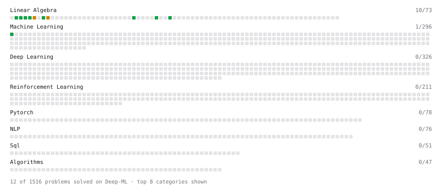

# Deep-ML

My machine learning practice from [Deep-ML](https://www.deep-ml.com). Every solution here was written by hand.

**10** solved · 6 problems · 0 labs · 4 math

[**Browse the interactive portfolio**](https://Baroloker.github.io/deep-ml/) to replay this filling in over time.

## Problems

| | Difficulty | Solved | |
| --- | --- | --- | --- |
| [Calculate 2x2 Matrix Inverse](https://www.deep-ml.com/problems/8) | easy | 2026-09-26 | [solution](problems/0008-calculate-2x2-matrix-inverse) |
| [Calculate Mean by Row or Column](https://www.deep-ml.com/problems/4) | easy | 2026-09-24 | [solution](problems/0004-calculate-mean-by-row-or-column) |
| [Linear Regression Using Normal Equation](https://www.deep-ml.com/problems/14) | easy | 2026-09-27 | [solution](problems/0014-linear-regression-using-normal-equation) |
| [Reshape Matrix](https://www.deep-ml.com/problems/3) | easy | 2026-09-24 | [solution](problems/0003-reshape-matrix) |
| [Scalar Multiplication of a Matrix](https://www.deep-ml.com/problems/5) | easy | 2026-09-25 | [solution](problems/0005-scalar-multiplication-of-a-matrix) |
| [Matrix times Matrix ](https://www.deep-ml.com/problems/9) | medium | 2026-09-28 | [solution](problems/0009-matrix-times-matrix) |

## Math

| | Difficulty | Solved | |
| --- | --- | --- | --- |
| [Matrix Basics](https://www.deep-ml.com/math-problems/9) | easy | 2026-09-28 | [solution](math/0009-matrix-basics) |
| [Vector Operations](https://www.deep-ml.com/math-problems/7) | easy | 2026-09-28 | [solution](math/0007-vector-operations) |
| [Matrix Multiplication](https://www.deep-ml.com/math-problems/10) | medium | 2026-09-28 | [solution](math/0010-matrix-multiplication) |
| [Vector Norms and Linear Independence](https://www.deep-ml.com/math-problems/8) | medium | 2026-09-28 | [solution](math/0008-vector-norms-and-linear-independence) |

---

_This file is regenerated by Deep-ML on every push._
